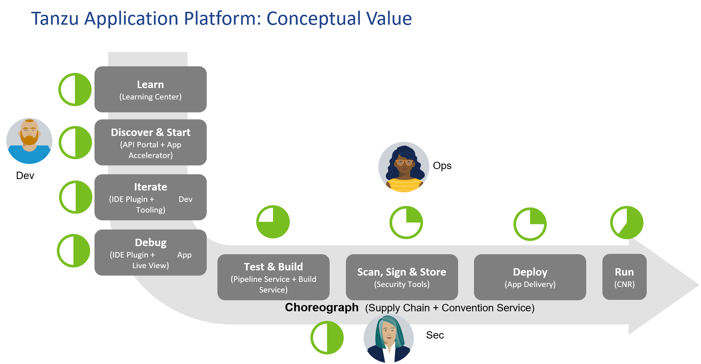

# Tanzu Application Platform v0.4 (beta-4)

##  Overview of Tanzu Application Platform

<strong>Warning:</strong> Tanzu Application Platform is currently in beta (intended for evaluation and test purposes only).

Tanzu Application Platform is a packaged set of components that helps developers and operators build, deploy, and manage apps on Kubernetes.

Simplify workflows in both the *inner loop* and *outer loop* of Kubernetes-based app development with  Tanzu Application Platform.

* **Inner Loop**:
    - The inner loop describes a developer’s development cycle of iterating on code.
    - Inner loop activities include coding, testing, and debugging before making a commit.
    - On cloud-native or Kubernetes platforms, developers in the inner loop often build container images and connect their app to all necessary services, apps, and  APIs to deploy it to a development environment.

* **Outer Loop**:
    - The outer loop describes how operators deploy apps to production and maintain them over time.
    - On a cloud-native platform, outer loop activities include building container images, adding container security, and configuring continuous integration and continuous delivery (CI/CD)  pipelines.
    - Outer loop activities are challenging in a Kubernetes-based development environment due to app delivery platforms being constructed from various third-party and open source components with numerous configuration options.

Tanzu Application Platform provides a default set of components that automates pushing an app to staging and production on Kubernetes, solving pains for both inner and outer loops. In addition, operators can customize the platform by replacing Tanzu Application Platform components with other products.

Kubernetes deployment complexity is reduced for operators with better automation and standardization of the outer loop, giving developers more time to focus on code.

##   Installation profiles and profiles in Tanzu Application Platform v0.4

Tanzu Application Platform is available through pre-defined profiles or individual packages.

The following profiles are available in Tanzu Application Platform:

- **Dev:**
  Contains packages that drive the Inner Loop personal developer experience of building and
  iterating on applications.

- **Full:**
  This profile contains all of the Tanzu Application Platform packages.

##  About installing the Tanzu Application Platform v0.4 (beta-4)

To install the Tanzu Application Platform profiles, see [Installing Tanzu Application Platform](install-intro.md).

##  Notice of telemetry collection for Tanzu Application Platform

[//]: # (This following text came from legal. Do not edit it.)

Tanzu Application Platform participates in VMware’s Customer Experience Improvement Program (CEIP).
As part of CEIP, VMware collects technical information about your organization’s use of VMware products and services
in association with your organization’s VMware license keys.
For information about CEIP, see the [Trust & Assurance Center](http://www.vmware.com/trustvmware/ceip.html).
You may join or leave CEIP at any time.
The CEIP Standard Participation Level provides VMware with information to improve its products and services,
identify and fix problems, and advise you on how to best deploy and use VMware products.
For example, this information can enable a proactive product deployment discussion with your VMware account team or
VMware support team to help resolve your issues.
This information cannot directly identify any individual.

[//]: # (The text above came from legal. Do not edit it.)

You must acknowledge that you have read VMware’s CEIP policy before you can proceed with the installation.
For more information, see [Install a Tanzu Application Platform profile](install.md#install-profile) in
_Installing part II: profiles_.
To opt out of telemetry participation after installation, see [Opting out of telemetry collection](opting-out-telemetry.md).
